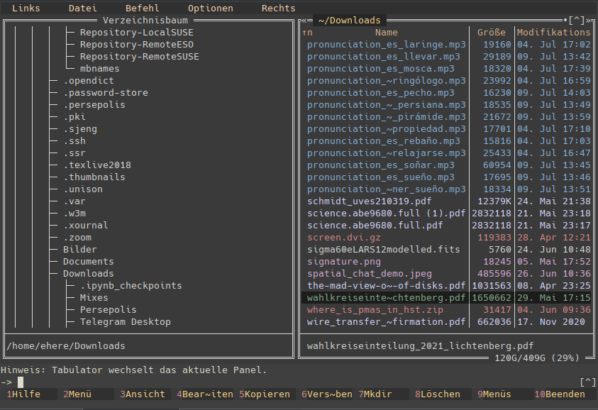

mc_zenburn.ini
==============

This is a Zenburn 256 colors MidnightCommander color scheme.  
Needs `mc > 4.7.5`.

- Author:
  - Dmitry Geurkov (`d.geurkov@gmail.com`)
  - some small fixes incl. creation of this git repo E.C. Herenz (`eherenz@eso.org`)
  
Installation / Usage
--------------------

- place `mc_zenburn.ini` in `${HOME}/.config/mc/`
- in `.bashrc` add: `export MC_SKIN=${HOME}/.config/mc/mc_zenburn.ini`

Screenshot
----------

